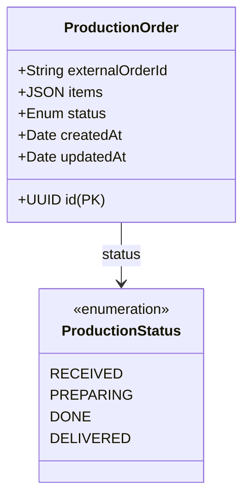

# Orders Production Manager

Microsserviço responsável pelo gerenciamento da fila de produção da cozinha (Tech Challenge). Este sistema opera em uma arquitetura distribuída e escalável na AWS, atuando como o núcleo de processamento dos pedidos após a confirmação de pagamento.

## 🚀 Tecnologias e Infraestrutura

*   **Framework**: [NestJS](https://nestjs.com/)
*   **Linguagem**: TypeScript
*   **Banco de Dados**: Amazon RDS (PostgreSQL)
*   **Mensageria**: Amazon SQS (Fila de pedidos recebidos)
*   **Orquestração**: Amazon EKS (Kubernetes)
*   **Container Registry**: Amazon ECR
*   **Qualidade**: SonarCloud & BDD (Cucumber)

## 📚 Contexto de Negócio e Modelagem

O sistema gerencia o ciclo de vida da produção dos itens de um pedido. Ele garante que a cozinha tenha visibilidade do que precisa ser preparado e permite o controle de status até a entrega.

### Estados do Pedido
1.  **RECEIVED**: Pedido recebido na cozinha (via SQS).
2.  **PREPARING**: Em preparação pelo chef.
3.  **DONE**: Pronto para retirada.
4.  **DELIVERED**: Entregue ao cliente.

### Diagrama de Dados


## 🏗️ Modos de Operação

A aplicação possui dois modos de execução controlados pela variável `APP_MODE`:

1.  **API (Padrão)**: Expõe endpoints REST, documentação Swagger e Health Checks.
2.  **WORKER**: Consumidor SQS dedicado que processa novos pedidos vindos do microsserviço de Pedidos.

---

## 🛠️ Configuração e Execução

### Pré-requisitos
*   **Node.js**: v24.11.1 (recomendado usar `nvm`)
*   **PostgreSQL**: v14+ (se rodar localmente)
*   **AWS CLI**: Configurado com credenciais válidas (para SQS/EKS)

### Variáveis de Ambiente (.env)
| Variável | Descrição | Exemplo |
| :--- | :--- | :--- |
| `APP_MODE` | `API` ou `WORKER` | `API` |
| `DB_HOST` | Host do banco (Local ou RDS) | `localhost` |
| `DB_PORT` | Porta do banco | `5432` |
| `DB_DATABASE` | Nome da base | `production_db` |
| `DB_SSL` | Habilitar SSL (Obrigatório RDS) | `true` |
| `AWS_SQS_QUEUE_URL`| URL da fila SQS | `https://sqs...` |

### Execução Local (Sem Docker)
1.  **Instalação**: `npm install`
2.  **Migrations**: `npx sequelize-cli db:migrate`
3.  **Seeds**: `npx sequelize-cli db:seed:all`
4.  **Rodar**: `npm run start:dev`

### Execução via Docker (Recomendado)
```bash
docker compose up --build
```

### Deploy no Kubernetes (EKS)
Os manifestos de infraestrutura estão em `infra/k8s/`. O deploy é automatizado via GitHub Actions, gerenciando ConfigMaps, Secrets e Deployments individuais para a API e o Worker.

---

## 🧪 Testes e Qualidade

Monitoramos a qualidade via SonarCloud com os seguintes comandos:

```bash
# Testes Unitários e Cobertura
npm run test:cov

# Testes BDD (Gherkin/Cucumber)
npx jest test/step-definitions/update-status.steps.spec.ts --rootDir .
```

---
**Tech Challenge - Grupo 110 FIAP**
