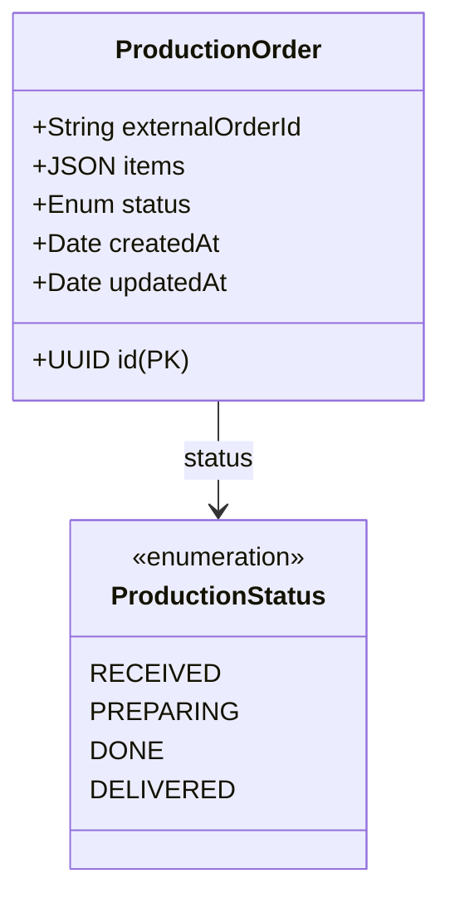

# Orders Production Manager

Microsserviço responsável pelo gerenciamento da fila de produção da cozinha (Tech Challenge).

## 🚀 Tecnologias

*   **Framework**: [NestJS](https://nestjs.com/)
*   **Linguagem**: TypeScript
*   **Banco de Dados**: PostgreSQL
*   **ORM**: Sequelize
*   **Documentação**: Swagger (OpenAPI)
*   **Testes**: Jest (Unitários e BDD)

## 🏛️ Modelagem de Dados

O sistema utiliza uma tabela principal `production_orders` para gerenciar os pedidos na cozinha.



### Estados do Pedido
1.  **RECEIVED**: Pedido recebido na cozinha.
2.  **PREPARING**: Em preparação.
3.  **DONE**: Pronto para retirada.
4.  **DELIVERED**: Entregue ao cliente.

## 🛠️ Configuração e Execução

### Pré-requisitos
*   Node.js v24.11.1 (use `nvm use`)
*   PostgreSQL rodando (Docker ou local)

### Variáveis de Ambiente
Crie um arquivo `.env` na raiz:
```env
DB_HOST=localhost
DB_PORT=5432
DB_USERNAME=postgres
DB_PASSWORD=sua_senha
DB_DATABASE=postgres
```

### Instalação
```bash
npm install
```

### Banco de Dados
```bash
# Criar tabelas (Migrations)
npx sequelize-cli db:migrate

# Popular com dados de teste (Seeds)
npx sequelize-cli db:seed:all
```

### Executar
```bash
# Desenvolvimento
npm run start:dev

# Produção
npm run build
npm run start:prod
```

A documentação da API estará disponível em: `http://localhost:8080/api`

## 🧪 Testes e Qualidade

O projeto possui uma pipeline de CI configurada para validar Pull Requests na branch `main`.

### Requisitos de Qualidade
*   **Build**: A aplicação deve compilar sem erros.
*   **Testes Unitários**: Cobertura mínima de 70%.
*   **Testes BDD**: Cenários Gherkin devem passar.

### Comandos de Teste
```bash
# Testes Unitários com Cobertura
npm run test:cov

# Testes BDD (Cucumber)
npx jest test/step-definitions/update-status.steps.spec.ts --rootDir .
```
